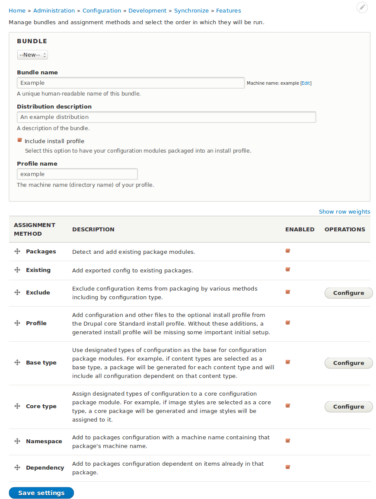

# Creating Features bundles

If you have an existing module that you want to convert into a features module, all you need to do is add an empty "modulename.features.yml" file to your module's base directory and then you will see the module listed in the Features page and can edit it and add config via the UI.

At **Administration > Configuration > Development > Features > Configure bundles** (`admin/config/development/features/bundle`), an admin screen similar to the Drupal core [language negotiation](https://www.drupal.org/node/1497176) screen, site admins can create bundles and enable, reorder, and configure packaging assignment methods.

## What is a bundle?

In most cases, the first thing you'll want to do when working with Features is to create a _bundle_.

Just what is a bundle? You can think of a bundle as a _set_ of features that share a common _namespace_.

A custom bundle includes a machine name that serves as _namespace_: a prefix that will be used for the machine name of all features that use the bundle. For example, if you use "banana" as the machine name for your bundle, all features that you generate as part of that bundle will be named beginning with `banana_`. A "page" Feature would be named `banana_page`.

Each bundle has its own configured set of assignment plugins that control how configuration is automatically packaged up into features in the bundle.

### The special Default bundle

When you first install Features, it comes with a built-in bundle called "Default". This bundle

*   It doesn't provide a namespace. Features created using the default bundle will not receive a name prefix. For example, a "blog" Feature created with the default bundle will have the machine name "blog".
*   Some of the default bundle's properties (its name and its machine name) are locked.
*   The default bundle cannot be deleted.

## Configuring the default bundle

The default bundle comes preconfigured with package assignment plugins. If you want to change the configuration:

1. Start at **Administration > Configuration > Development > Features > Configure bundles** (`admin/config/development/features/bundle`).
1. Ensure "Default" is selected for "Bundle".
1. [Configure the package assignment plugins](/features/build--packaging).
1. At the bottom of the form, click "Save settings".

## Creating a new bundle

To create a new bundle:

1. Start at **Administration > Configuration > Development > Features > Configure bundles** (`admin/config/development/features/bundle`).
1. Select "--New--" for Bundle.
1. Fill in values. "Name" and "Machine name" are required.
1. If you want to create an install profile with the bundle, check "Include install profile" and give a machine name for the install profile (which can be the same as the machine name for your bundle). Including an install profile is usually a good idea, as it makes it easier to install your set of features on a new site.
1. At the bottom of the form, click "Save settings".

When you create a new bundle, it inherits the assignment plugin configuration of the default bundle.

## Deleting a bundle

To delete a bundle:

*   Use the "Bundle" select to select the bundle's name.
*   Click "Remove bundle".

## Editing an existing bundle

To edit an existing bundle:

1. Start at **Administration > Configuration > Development > Features > Configure bundles** (`admin/config/development/features/bundle`).
1. Use the "Bundle" select to select the bundle's name.
1. Edit existing values. "Name" and "Machine name" are required.
1. At the bottom of the form, click "Save settings".
