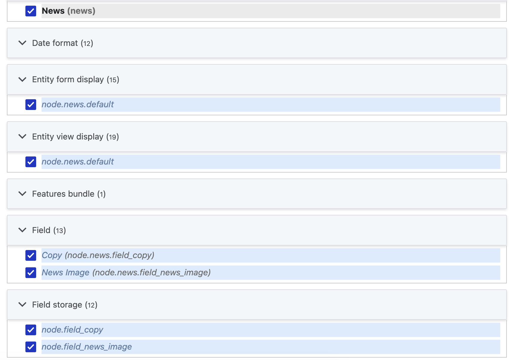

# Equivalent actions without the Features module

With Drupal's configuration management system now mature, developers can accomplish the same tasks traditionally associated with the Features module using existing tools. This page details techniques for achieving common configuration bundling and deployment tasks using only the existing Drupal API and Drush commands.

## Task: Create a module to bundle configuration

The Features module included the ability to scaffold a Drupal module. Nowadays, that can be accomplished in various other ways, such as `drush generate module`. No need for Features!

## Task: Bundle a subset of configuration into a module

For the purposes of this example, let's consider a simple "News" content type (machine name `news`), with copy text and media fields, and a corresponding View that displays all news items. You would first create these elements in the Drupal UI.

Traditionally, using the Features UI, you would then select the "News" content type and the corresponding View, and Features would help discover dependencies:



You would need to use your expertise to evaluate which dependencies should actually be packaged in the module. For example, since our News content type includes a media field, Features would suggest adding the "Image" media type. But if this media type already exists on the site, it shouldn't be added to the Feature , and you would remove that configuration item from the Features suggestion.

This process can be approximated a small script that takes the relevant bits from the Features UI:

```php
<?php

// Drush automatically makes available PHP argv via $extra.
$dependency_name = $extra[0];
$dependency_type = 'config';
$config_manager = \Drupal::service('config.manager');
$dependents = $config_manager->getConfigEntitiesToChangeOnDependencyRemoval(
  $dependency_type,
  [$dependency_name]
);
echo $dependency_name . PHP_EOL;
foreach (array_values($dependents) as $config_entities) {
  foreach ($config_entities as $config_entity) {
    if (method_exists($config_entity, 'getFieldStorageDefinition')) {
      $storage = $config_entity->getFieldStorageDefinition();
      print_r('field.storage.' . $storage->id() . PHP_EOL);
    }
    print_r($config_entity->getConfigDependencyName() . PHP_EOL);
  }
}

```

Executing `drush php:script get-dependencies.php node.type.news` would generate a list of the configuration items you might want to bundle:

```bash
node.type.news
core.entity_view_display.node.news.default
core.entity_form_display.node.news.default
field.storage.node.field_copy
field.field.node.news.field_copy
field.storage.node.field_news_image
field.field.node.news.field_news_image
```

You could then use Drush commands to export these configuration items to your module:

```bash
mkdir -p web/modules/my_module/config/install
CONFIG_NAME="core.entity_view_display.node.news.default"
drush config:get $CONFIG_NAME --format=yaml > web/modules/my_module/config/install/$CONFIG_NAME.yml
# Strip UUID and core keys to make this work on any site
drush yaml:unset:key web/modules/my_module/config/install/$CONFIG_NAME.yml uuid
drush yaml:unset:key web/modules/my_module/config/install/$CONFIG_NAME.yml _core
```

This could be abstracted into a script; a very simple example is shown below:

```bash
echo "Enter path to export (e.g., web/modules/custom/my_module/config/install)"
read EXPORT_DIRECTORY
echo "Enter space-separated list of configuration to export (e.g., core.entity_view_display.node.news.default core.entity_form_display.node.news.default field.field.node.news.field_copy field.field.node.news.field_news_image)"
read CONFIGS
mkdir -p $EXPORT_DIRECTORY
for CONFIG in $CONFIGS; do
  FILE="$EXPORT_DIRECTORY/$CONFIG.yml"
  echo "Exporting $CONFIG..."
  drush config:get $CONFIG --format=yaml > $FILE
  drush yaml:unset:key $FILE uuid
  drush yaml:unset:key $FILE _core
done
```

At this point, without using Features, you would have done the equivalent of using the Features UI to write a module consisting of the following:

```bash
web/modules/custom/my_module/
├── config
│   └── install
│       ├── core.entity_form_display.node.news.default.yml
│       ├── core.entity_view_display.node.news.default.yml
│       ├── field.field.node.news.field_copy.yml
│       ├── field.field.node.news.field_news_image.yml
│       ├── field.storage.node.field_copy.yml
│       ├── field.storage.node.field_news_image.yml
│       └── node.type.news.yml
└── my_module.info.yml
```

## Task: Deploy new functionality to a site

This step is the same as it always has been. The Features module simply bundled configuration into a module; enabling configuration shipped in a module is part of Drupal's standard behavior. Once you enable the module, all configuration in the <code>config/install</code> directory will be written to the site.

## Task: Review changes to configuration before writing

In our example "News" module, let's say you wanted to update the copy field to make the summary required. You would make the change in the UI, and then go to the Features UI, which would show configuration overridden. That same information can be found using Drush and Git:

```
drush cex -y
# Make the configuration changes
drush cex -y
git diff
```

```diff
diff --git a/field.field.node.news.field_copy.yml b/field.field.node.news.field_copy.yml
index b8ddc99..f0787b1 100644
--- a/field.field.node.news.field_copy.yml
+++ b/field.field.node.news.field_copy.yml
@@ -19,6 +19,6 @@ default_value: {  }
 default_value_callback: ''
 settings:
   display_summary: false
-  required_summary: false
+  required_summary: true
   allowed_formats: {  }
 field_type: text_with_summary
```

## Task: Write configuration changes to a module

Writing any staged changes to the module you already created is fully scriptable:

```bash
echo "Enter path to write changes (e.g., web/modules/custom/my_module/config/install)"
read EXPORT_DIRECTORY
FILES=$(find $EXPORT_DIRECTORY -name '*.yml')
for FILE in $FILES; do
  CONFIG=$(echo $(basename "${FILE%.*}"))
  echo "Rebuilding $CONFIG..."
  drush config:get $CONFIG --format=yaml > $FILE
  drush yaml:unset:key $FILE uuid
  drush yaml:unset:key $FILE _core
done
```

## Task: Deploy updated configuration to a site

With the Features module, this was performed via remote execution of the Drush command <code>features import</code> or staged as part of a database update:

```php
<?php
/**
 * Update site configuration from files using the Features API.
 */
function my_module_update_8000() {
  \Drupal::service('features.manager')->import([
    'my_module',
  ], TRUE);
}
```

Without Features, this can also be done via remote execution of a Drush command:

```bash
drush config:import --partial --source=/app/web/modules/custom/my_module/config/install
```

Or it can be done using an update hook using just Drupal core APIs:

```php
<?php

use Symfony\Component\Yaml\Yaml;

/**
 * Update site configuration from module using Configuration API.
 */
function my_module_update_8001() {
  $module_path = \Drupal::service('module_handler')->getModule('my_module')->getPath();
  foreach (glob("$module_path/config/install/*.yml") as $config_path) {
    $info = pathinfo($config_path);
    $config_name = basename($config_path, '.' . $info['extension']);
    $data = Yaml::parse(file_get_contents($config_path));
    \Drupal::configFactory()->getEditable($config_name)->setData($data)->save(TRUE);
  }
}
```
