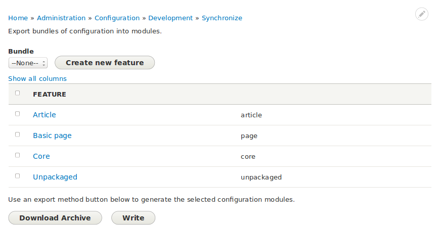

---
hide:
  - toc
---

# Getting Started

To get started, install [Features](https://www.drupal.org/project/features) and its dependency, [Configuration Update Manager](https://www.drupal.org//project/config_update). Be sure to enable the Features UI module (included as part of the main Features project).

The configuration page where you build features is not the easiest to find--it's deeply nested at **Administration > Configuration > Development > Features** (`admin/config/development/features`).

As well as showing what configuration has been assigned to which feature, the Feature generation screen also shows configuration that has _not_ been packaged. By analyzing what has not been packaged, you may be able to determine how best to configure Features so as to improve how features are created and configuration assigned to them.

## Generation options

There are two ways you can generate features: download an archive or write the features directly to the file system.

In order for the write method to work the web server must have write access to the file system. Which directory you need to make writable depends on how you've configured your bundle. If it's configured to include an install profile, the directory you need to make writable is `profiles`. Otherwise, it's `modules`.

If you chose to generate an archive, you will need to extract it to be able to continue developing your features. If your bundle is configured to include an install profile, extract it to `profiles`. Otherwise, extract it to `modules`.
