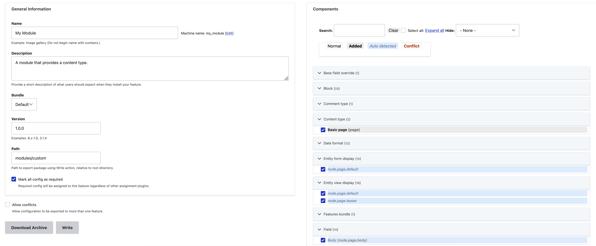

---
hide:
  - toc
---

# Introduction

"Features" provides a user interface to bundle subsets of Drupal configuration into modules and an API to manage that configuration over time. The user interface looks like this:

## Do I still need Features today?
Maybe not. Features may still serve a place in the Drupal ecosystem for certain users, but you should read what follows and decide whether another approach is better. A quick historical overview helps.

Features was created during the Drupal 7 lifecycle when Drupal core had limited configuration packaging options. At the time, Features was basically the only viable way to package and deploy configuration at scale.

In 2015, Drupal 8 brought [configuration management](https://www.drupal.org/docs/administering-a-drupal-site/configuration-management), the now-standard way to manage configuration for individual sites. The value of Features became focused on packaging _subsets_ of configuration, either as modules or distributions, for use on multiple sites.

In 2026, [Drupal Recipes](https://new.drupal.org/browse/recipes) introduced a powerful way to share subsets of configuration, making the use case for Features even narrower (explained below).

Drupal command line tools and APIs have also matured. Much of the bundling and deployment provided by Features [can be accomplished through scripted commands](/features/developers--do-you-need-features).

## How is Features different from core configuration management?

Drupal core's [configuration management system](https://www.drupal.org/docs/administering-a-drupal-site/configuration-management) is designed to manage site configuration as a whole. Features uses the same system but facilitates managing only part of the site configuration. Where Drupal core configuration exports include site-specific UUIDs, Features omits the UUIDs, making it possible to reuse a Feature  across multiple sites.

## How is Features different from Recipes?

Features was a precursor to [Drupal Recipes](https://new.drupal.org/browse/recipes). **For most scenarios nowadays, Drupal Recipes should replace Features.** Recipes are the right choice for quickly spinning up common site requirements like image galleries, sensible security defaults, or eCommerce integrations. But by design, Recipes do not supply updates. So if you want to add functionality to a site _and periodically update that configuration_, Features is still the right choice. Use Features when you want to:

* Deploy bundled functionality across multiple sites and provide periodic enhancements or fixes to all sites, where the component behaves the same across all sites over time.
* Deploy bundled functionality to a single site and be able to make changes to that configuration over time without having to manage the site's configuration as a whole.

## How is Features different from Config Split?

Like the Features module, the [Config Split](https://www.drupal.org/project/config_split) module provides a way to manage subsets of site configuration. The main difference is Config Split must be configured site-by-site. You cannot use Config Split to roll out changes across multiple sites.

## I'm a proficient Drupal developer with a deep understanding of configuration management. Do I need Features?

Maybe not. Read about achieving [equivalent actions without the Features module](/features/developers--do-you-need-features).
